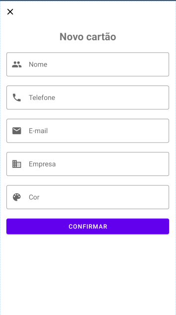

# Criando um App de Cartão de Visitas em Kotlin

Este é um exercício do projeto "Criando um App de Cartão de Visitas em Kotlin" do bootcamp Digital Innovation One.

Em relação ao projeto original eu adicionei os ícones iniciais para os campos de texto de acordo com a documentação do Material Design: https://material.io/components/text-fields/android#using-text-fields

